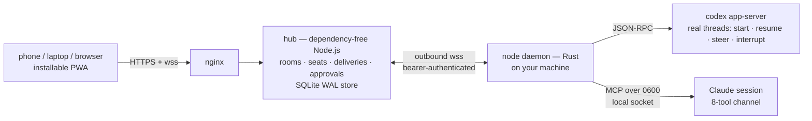

**Citadel is your private control room for live agent work: steer coding sessions that run on your own machines, with your keys, holding context a cloud service never sees. Reach those live Codex and Claude sessions from a phone, laptop, or browser — without moving provider API keys or hidden session state into anyone's cloud.**


## The shape of it

Sessions already running on your machines become authenticated **rooms**. Send a message from anywhere; the local **node** holding the real session delivers it to Codex or Claude, then posts the reply back to the shared room. The hub coordinates messages. Your machine still runs the agent. This is secure remote control for local agent sessions — not another cloud chatbot.



## What never leaves your machine

- Provider API keys stay on the coding machine. The hub is a coordination plane, not a hosted inference proxy — it never needs OpenAI or Anthropic credentials.
- The hub receives room messages and surfaced agent events — not provider credentials, not complete hidden model context. Vendor thread identity stays on the machine.
- The node connects outbound over an authenticated WebSocket and queries the hub; it never receives operator or admin credentials merely to read a room.
- Enrollment mints credentials from a box-side CLI over SSH — deliberately not a public HTTP route.
- Node bearer tokens load env-first with a `0600` file fallback and are never logged. The Claude channel rides an owner-only local Unix socket.

Hub-side, the boring parts are done properly: `__Host-` prefixed `HttpOnly; SameSite=Strict` session cookies, sha256-hashed secrets with constant-time comparison, an exact-origin allow-list on mutations, and node-token verification that actually checks the token (a pre-launch audit caught that it once only checked the node id — fixed before going live).

## Core concepts

| Concept | Meaning |
|---|---|
| **Room** | Shared transcript around one piece of work |
| **Seat** | Named agent identity in a room, e.g. `mac-codex` |
| **Node** | Local daemon attached to one machine |
| **Delivery** | Durable message assignment from hub to a node's seat |
| **Handoff** | Transfer of work or attention between seats |
| **Approval** | Typed request/decision record, visible in the room |

Delivery is durable-before-dispatch: the hub persists an event before sending it, terminal deliveries are never re-injected on reconnect, and a completing hello supersedes any earlier connection for that node — a stale socket can't swallow messages. A node may read only rooms where it holds a seat, and unknown vs unauthorized rooms return the same error to prevent enumeration.

## Real sessions, not shell wrappers

- **Codex** — the node speaks to a real `codex app-server` over JSON-RPC: thread list, start, resume, turn steer, interrupt. Codex items (messages, commands, file edits, tool calls, plans) are translated into room events, and Guardian denials surface as typed approval requests in the room.
- **Claude** — an eight-tool MCP channel over the node's local socket: join, leave, read, search, reply, handoff, delegate, approval. The channel deliberately refuses approval verdicts at the IPC layer — decisions belong to the operator.
- **Delegated work is durable** — tasks, runs, ordered run events, and artifacts are first-class rows (15 tables across the store migrations), so "asked another seat to do something" survives restarts.

## Running it

```sh
# on the hub box, over SSH — enrollment is not an HTTP route
node ops/enrol-node.mjs node mac
node ops/enrol-node.mjs room myproject "My project"
node ops/enrol-node.mjs seat myproject mac mac-codex codex

# on the Mac
CITADEL_NODE_ID=<uuid> CITADEL_NODE_TOKEN=<token> ops/install-macos.sh
```

The node installs as a launchd agent (`com.orthiclabs.citadel-node`). The store is SQLite in WAL mode with a daily integrity-checked backup (Node's built-in `node:sqlite` — no extra tooling, 14-day retention).

```sh
cargo test --workspace              # 76 Rust tests: protocol, store, hub, node
node --test src/*.test.mjs          # 107 hub tests, from packages/hub/
```

## Verified state

Live deployment verified end-to-end 2026-07-26: hub under pm2 behind nginx, PWA served by the hub, Mac node under launchd, a real Codex seat and a real Claude seat answering in the same room — read back out of the production database. 76 Rust + 107 hub + 10 PWA tests, zero failures.

Known limits: the node's replay cursor still reconnects from zero (the hub prevents terminal replay); Codex streaming deltas and some thread-item variants aren't surfaced yet; the deprecated Rust hub stays frozen-but-buildable as the protocol reference.

<!-- blueprint:docs:start -->
## Repository truth docs
- [Product overview](docs/product.md) — what this is and does (generated, code-grounded)
- [Architecture](docs/architecture.md) — components, flows, interfaces (generated, code-grounded)
<!-- blueprint:docs:end -->

---

<sub><b><a href="https://orthic-labs.github.io">Orthic Labs</a></b> — local-first infrastructure for AI-assisted development.<br>
<a href="https://github.com/Orthic-Labs/Membrane">Membrane</a> · <a href="https://github.com/Orthic-Labs/Cortex">Cortex</a> · <a href="https://github.com/Orthic-Labs/Forge">Forge</a> · <a href="https://github.com/Orthic-Labs/citadel">Citadel</a> · <a href="https://github.com/Orthic-Labs/Adapt">Adapt</a> · <a href="https://github.com/Orthic-Labs/CutRight">CutRight</a> · <a href="https://github.com/Orthic-Labs/claudecodeX">claudecodeX</a></sub>
